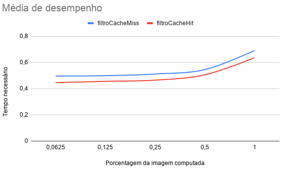
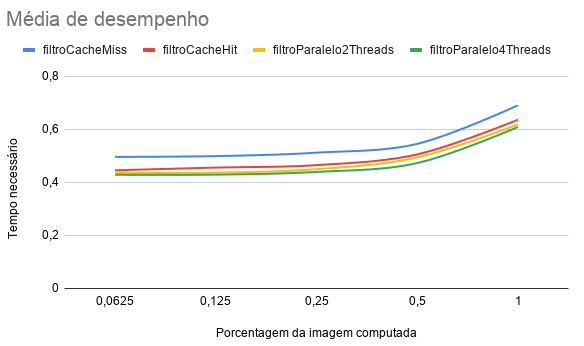

# PPGI - Arquitetura de Computadores - Atividade 5

# Introdução 

Uma imagem RGB possui três bandas, uma banda Red, uma banda Green e a outra Blue e essas bandas são as matriz numéricas da imagem. Aplicação do filtro negativo em imagem é, basicamente, uma subtração entre 255 e o valor de RGB de cada banda da imagem, ou seja , a operação é realizada na imagem completa. Essa operação transforma a cor original de cada pixel em sua cor inversa, a cor complementar. As cores complementares do sistema RGB são as cores do sistema CMY.

# Background

A classe Mat é bastante usada pelo OpenCV, essa classe faz a abertura da imagem dado o seu endereço e armazena a imagem no formato de uma matriz, sendo dividida em duas partes:

* Cabeçalho da matriz, contendo informações como o tamanho da matriz, o método usado para armazenamento, em que endereço a matriz está armazenada, e assim por diante.
* Um ponteiro para a matriz contendo os valores dos pixels, cuja dimensão vai depender do método de armazenamento.

Nos métodos de armazenamento do OpenCV, você pode escolher o sistema de cores e o tipo de dado utilizado. O OpenCV usa um sistema BGR para se referir ao sistema de cores RGB e cada componente da cor tem seu próprio domínio de valores. O OpenCV armazena as imagens na memória como objetos Mat. Usando sistema de cores RGB, o OpenCV armazena a imagem como um grande array multidimensional de proporções CH x L x C. No qual CH é o número de canais da imagem, no caso 3 (Red, Green e Blue), L é o número de linhas e C o número de colunas, a intersecção entre as linhas e as colunas são pontos da imagem, que são representados por pixels.

Já em relação ao paralelismo, foi utilizado o OpenMP que é uma API para programação paralela para arquiteturas de memória compartilhada. Essa programação consiste em um conjunto de diretivas que são compreendidas  pelo compilador e influenciam na execução do programa.  O OpenMP usa um modelo que possui uma thread master, e sempre que necessário novas threads são disparadas para que o trabalho seja dividido. No geral, esse código fará a aplicação do filtro negativo em proporções diferentes de uma imagem de dimensões 2560×1440.

# Métodos e Resultados

## Sem Otimização

Na primeira versão do código, denominado de “filtroCacheMiss.cpp”, a biblioteca OpenCV faz a manipulação de imagens e a partir do main, o procedimento void neg(...) é chamado, fazendo a conversão da imagem normal para a sua versão negativa, essa operação é feita através de três estruturas de repetição for aninhados, onde a primeira estrutura itera sobre os canais da imagem (RGB), e os dois  mais internos irão iterar sobre as linhas e colunas da matriz da imagem. E dentro desses for aninhados é feita a subtração no valor da banda de cada pixel da imagem, gerando o negativo da mesma ao final do processo.

Pelo fato de o for mais externo iterar sobre as bandas da imagem, cada elemento da matriz será analisado três vezes, uma para cada banda da imagem (RGB), sabendo disso o código do arquivo “filtroCacheMiss.cpp” não faz uma boa utilização da memória cache. 

## Com Otimização de Cache

Tendo como base essa informação, disso foi desenvolvido  o segundo código, denominado “filtroCacheHit.cpp”, onde no procedimento void neg(...) é utilizado apenas duas estruturas de repetição for, percorrendo as linhas e colunas da matriz da imagem, e dentro desses for fazemos a subtração nos canais RGB da imagem diretamente.

A abordagem do arquivo “filtroCacheHit.cpp” se provou mais eficiente em comparação com a do arquivo “filtroCacheMiss.cpp”. Pois com o código no “filtroCacheHit.cpp” há uma melhor utilização da memória em relação ao código de “filtroCacheMiss.cpp”. É possível ver no gráfico abaixo o desempenho dos dois códigos :

|                  |  filtroCacheMiss |  filtroCacheHit |
|------------------|------------------|-----------------|
|  6,25% da imagem |  0,496382s       | 0,44583s        |
| 12,5% da imagem  |  0,49924s        | 0,4559s         |
|  25% da imagem   |  0,512122s       |  0,46519s       |
| 50% da imagem    |  0,54543s        |  0,505677s      |
|  100% da imagem  |  0,69097s        |  0,636387s      |

## Paralelismo

Além das mudanças feitas para se utilizar a memória cache de forma eficiente, o código relacionado a “filtroCacheHit.cpp” foi paralelizado e renomeado para “filtroParalelo.cpp”, onde faz uso da biblioteca OpenMP para gerenciar as threads. O arquivo “filtroParalelo.cpp” faz a paralelização da chamada do método void neg(...) e dentro desse método também faz a paralelização do conjunto do for aninhados visto anteriormente no arquivo “filtroCacheHit.cpp”.

Abaixo é possível ver o gráfico da média de desempenho comparando os arquivos “filtroCacheMiss.cpp”, “filtroCacheHit.cpp” e o “filtroParalelo.cpp”, onde este último faz a utilização de duas e quatro threads para aplicação do filtro negativo.

|                  |  filtroCacheMiss |  filtroCacheHit |  filtroParalelo2Threads |  filtroParalelo4Threads |
|------------------|------------------|-----------------|-------------------------|-------------------------|
|  6,25% da imagem |  0,496382s       |  0,44583s       |  0,436s                 | 0,42888s                |
| 12,5% da imagem  |  0,49924s        |  0,4559s        |  0,43701s               | 0,42942s                |
|  25% da imagem   |  0,512122s       |  0,46519s       |  0,44989s               | 0,43959s                |
| 50% da imagem    |  0,54543s        |  0,505677s      |  0,49422s               | 0,47293s                |
|  100% da imagem  |  0,69097s        |  0,636387s      |  0,61845s               | 0,60897s                |

# Conclusão

É possível perceber que o código do “filtroParalelo.cpp” com duas e quatro threads tem uma melhor desenvoltura de processamento em relação ao código do “filtroCacheHit.cpp”. E os  dois códigos possuem um desempenho superior ao código do “filtroCacheMiss.cpp”. 

A utilização de threads ajuda no desempenho de códigos de programação, mas esses benefícios não são constantes, chega um momento em que aumentar o número de threads não vai melhorar o desempenho do seu código, e também existem cenários em que a criação excessiva de threads pode acarretar em perda de desempenho.
